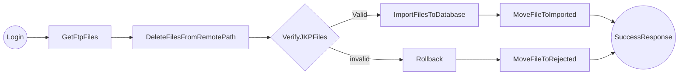
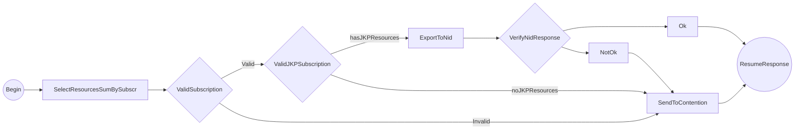
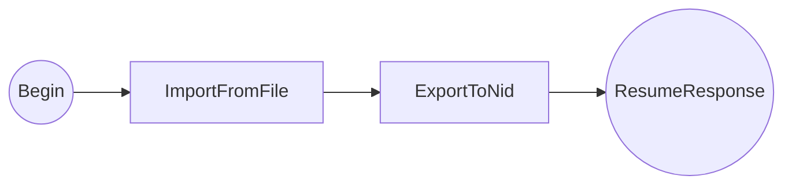

# JKP - Eletronic Data Interchange

#### GET /import-from-file

Imports the JKP files from FTP setted in JKP_IMPORT entry on env.chipher file to Local database 

- deletes the original files from FTP
- imports the files
- rejects files with wrong patters (all rows are not imported)
- send notifications if the file as not imported

JKP file have this patterns: 

- 20181227132650_e9cf97f063f3d4ed7a4faee0c064e3da.jkp 
- 20181227132650  - Create date of file (used as KEY of file)
- e9cf97f063f3d4ed7a4faee0c064e3da - MD5SUM of file
- .jkp  - Obligatory Extension (.jkp)

 @query import_from_ftp (y) if set as "n" avoid the import of files from FTP 
 @query delete_ftp_files (y) if set as "n" not delete the JKP files on FTP server @query send_import_error_notification (y) is set as "n" not send the error notification on import process 
 @return  Json with a summary of import process

#### GET /export-to-odin
Exports from database all rows in eletronic_data_interchange.consumption where is_sent is NULL or is_sent = "0000-00-00 00:00:00" summarizing by subscription.

If subscription is not Active, don't have the JKP resources or happen some process error, the registers will be marked as sent (is_sent = NOW()) and the data will be recorded in contention table. If everything goes well the register will be send to API IncrementResourceUsage_API

 @query send_export_error_notification (y) is set as "n" not send the error notification on export process
 @return Json with a summary of export process

#### GET /process

Executes: /import-from-file and /export-to-odin

 @query import_from_ftp (y) if set as "n" avoid the import of files from FTP 
 @query delete_ftp_files (y) if set as "n" not delete the JKP files on FTP server 				
 @query send_import_error_notification (y) is set as "n" not send the error notification on import process
 @query send_export_error_notification (y) is set as "n" not send the error notification on export process
 @return  Json with a summary of import/export process

